# FRNDLY — ENTITY RELATIONSHIP DIAGRAM

**Project:** FRNDLY
**Document:** Entity Relationship Diagram
**Version:** 1.0.0
**Status:** Approved Baseline
**Last Updated:** 2026-08-08
**Database:** MySQL / MariaDB
**ORM:** Laravel Eloquent

---

# 1. PURPOSE

Dokumen ini mendefinisikan struktur data dan hubungan antar-entitas pada aplikasi FRNDLY.

Dokumen ini menjadi acuan utama untuk:

* Database schema
* Laravel Migration
* Laravel Model
* Foreign Key
* Relationship Eloquent
* Query
* Reporting
* Transaction
* Data integrity

Prinsip utama:

> **Database adalah Single Source of Truth FRNDLY.**

---

# 2. DATABASE ARCHITECTURE

Struktur database FRNDLY dibagi menjadi beberapa kelompok:

```text
MASTER DATA
├── customers
├── product_categories
├── products
├── product_variants
├── product_prices
└── company_settings

TRANSACTION
├── orders
├── order_items
├── order_item_sizes
├── payments
└── invoices

PRODUCTION
├── designs
├── design_revisions
├── production_orders
└── production_events

SHIPPING
├── shipments
└── shipment_events

CUSTOMER EXPERIENCE
├── reviews
└── testimonials

SYSTEM
├── users
├── attachments
├── activities
├── audit_logs
├── reminders
├── backups
└── application_settings
```

---

# 3. CORE ENTITY MAP

Hubungan utama FRNDLY:

```text
                         ┌──────────────┐
                         │  CUSTOMERS   │
                         └──────┬───────┘
                                │
                                │ 1:N
                                ▼
                         ┌──────────────┐
                         │    ORDERS    │
                         └──────┬───────┘
                                │
          ┌─────────────────────┼─────────────────────┐
          │                     │                     │
          │ 1:N                 │ 1:N                 │ 1:N
          ▼                     ▼                     ▼
   ┌──────────────┐      ┌──────────────┐      ┌──────────────┐
   │ ORDER_ITEMS  │      │   PAYMENTS   │      │   INVOICES   │
   └──────┬───────┘      └──────────────┘      └──────────────┘
          │
          │ N:1
          ▼
   ┌──────────────┐
   │   PRODUCTS   │
   └──────┬───────┘
          │
          ▼
   ┌──────────────────┐
   │ PRODUCT_VARIANTS │
   └──────────────────┘


ORDER
 │
 ├──── 1:N ──── DESIGNS
 │                 │
 │                 └── 1:N ─── DESIGN_REVISIONS
 │
 ├──── 1:1 ──── PRODUCTION_ORDERS
 │                 │
 │                 └── 1:N ─── PRODUCTION_EVENTS
 │
 ├──── 1:N ──── SHIPMENTS
 │                 │
 │                 └── 1:N ─── SHIPMENT_EVENTS
 │
 └──── 1:N ──── REVIEWS
```

---

# 4. PRIMARY KEY STANDARD

Semua tabel utama menggunakan:

```text
id BIGINT UNSIGNED AUTO_INCREMENT
```

Primary key internal digunakan sebagai identitas database.

Human-readable identifier digunakan sebagai identifier bisnis.

Contoh:

```text
id = 125
order_number = ORD-20260808-001
```

---

# 5. COMMON TIMESTAMP

Mayoritas tabel menggunakan:

```text
created_at
updated_at
```

Tabel yang mendukung soft delete menggunakan:

```text
deleted_at
```

---

# 6. USERS

Menyimpan akun admin.

### Table

```text
users
```

### Fields

| Field          | Type            | Constraint   |
| -------------- | --------------- | ------------ |
| id             | BIGINT UNSIGNED | PK           |
| name           | VARCHAR(100)    | NOT NULL     |
| email          | VARCHAR(255)    | UNIQUE       |
| password       | VARCHAR(255)    | NOT NULL     |
| avatar         | VARCHAR(500)    | NULL         |
| is_active      | BOOLEAN         | DEFAULT TRUE |
| last_login_at  | TIMESTAMP       | NULL         |
| remember_token | VARCHAR(100)    | NULL         |
| created_at     | TIMESTAMP       |              |
| updated_at     | TIMESTAMP       |              |

---

# 7. CUSTOMERS

Menyimpan seluruh customer.

### Table

```text
customers
```

### Fields

| Field         | Type            | Constraint |
| ------------- | --------------- | ---------- |
| id            | BIGINT UNSIGNED | PK         |
| name          | VARCHAR(150)    | NOT NULL   |
| phone         | VARCHAR(30)     | NOT NULL   |
| email         | VARCHAR(255)    | NULL       |
| address       | TEXT            | NULL       |
| city          | VARCHAR(100)    | NULL       |
| province      | VARCHAR(100)    | NULL       |
| notes         | TEXT            | NULL       |
| total_orders  | INT UNSIGNED    | DEFAULT 0  |
| total_spent   | DECIMAL(15,2)   | DEFAULT 0  |
| last_order_at | TIMESTAMP       | NULL       |
| created_at    | TIMESTAMP       |            |
| updated_at    | TIMESTAMP       |            |
| deleted_at    | TIMESTAMP       | NULL       |

### Relationship

```text
Customer 1 ─── N Orders
```

---

# 8. PRODUCT CATEGORIES

Kategori produk.

Contoh:

```text
Kaos
Jaket
Lanyard
ID Card
Event Attribute
```

### Table

```text
product_categories
```

### Fields

| Field       | Type            | Constraint   |
| ----------- | --------------- | ------------ |
| id          | BIGINT UNSIGNED | PK           |
| name        | VARCHAR(100)    | UNIQUE       |
| description | TEXT            | NULL         |
| is_active   | BOOLEAN         | DEFAULT TRUE |
| created_at  | TIMESTAMP       |              |
| updated_at  | TIMESTAMP       |              |
| deleted_at  | TIMESTAMP       | NULL         |

---

# 9. PRODUCTS

Master produk.

Produk tidak menyimpan transaksi individual.

### Table

```text
products
```

### Fields

| Field       | Type            | Constraint    |
| ----------- | --------------- | ------------- |
| id          | BIGINT UNSIGNED | PK            |
| category_id | BIGINT UNSIGNED | FK            |
| name        | VARCHAR(150)    | NOT NULL      |
| code        | VARCHAR(50)     | UNIQUE        |
| description | TEXT            | NULL          |
| unit        | VARCHAR(30)     | DEFAULT 'pcs' |
| is_active   | BOOLEAN         | DEFAULT TRUE  |
| created_at  | TIMESTAMP       |               |
| updated_at  | TIMESTAMP       |               |
| deleted_at  | TIMESTAMP       | NULL          |

### Relationship

```text
ProductCategory 1 ─── N Products
```

---

# 10. PRODUCT VARIANTS

Variasi produk.

Contoh kaos:

```text
Bahan
Warna
Model
```

### Table

```text
product_variants
```

### Fields

| Field      | Type            | Constraint |
| ---------- | --------------- | ---------- |
| id         | BIGINT UNSIGNED | PK         |
| product_id | BIGINT UNSIGNED | FK         |
| name       | VARCHAR(100)    | NOT NULL   |
| value      | VARCHAR(100)    | NOT NULL   |
| created_at | TIMESTAMP       |            |
| updated_at | TIMESTAMP       |            |
| deleted_at | TIMESTAMP       | NULL       |

### Relationship

```text
Product 1 ─── N ProductVariants
```

---

# 11. PRODUCT PRICES

Riwayat harga produk.

Harga tidak boleh hanya disimpan pada product master karena harga dapat berubah.

### Table

```text
product_prices
```

### Fields

| Field           | Type            | Constraint |
| --------------- | --------------- | ---------- |
| id              | BIGINT UNSIGNED | PK         |
| product_id      | BIGINT UNSIGNED | FK         |
| variant_id      | BIGINT UNSIGNED | FK, NULL   |
| min_quantity    | INT UNSIGNED    | NOT NULL   |
| max_quantity    | INT UNSIGNED    | NULL       |
| selling_price   | DECIMAL(15,2)   | NOT NULL   |
| cost_price      | DECIMAL(15,2)   | NOT NULL   |
| effective_from  | DATE            | NOT NULL   |
| effective_until | DATE            | NULL       |
| notes           | TEXT            | NULL       |
| created_by      | BIGINT UNSIGNED | FK         |
| created_at      | TIMESTAMP       |            |
| updated_at      | TIMESTAMP       |            |

### Contoh

```text
Kaos
1–11 pcs     Rp75.000
12–23 pcs    Rp65.000
24–49 pcs    Rp55.000
50+ pcs      Rp45.000
```

Harga dapat dikustomisasi oleh admin.

---

# 12. ORDERS

Entitas utama transaksi.

### Table

```text
orders
```

### Fields

| Field            | Type            | Constraint |
| ---------------- | --------------- | ---------- |
| id               | BIGINT UNSIGNED | PK         |
| order_number     | VARCHAR(30)     | UNIQUE     |
| customer_id      | BIGINT UNSIGNED | FK         |
| status           | VARCHAR(30)     | NOT NULL   |
| order_date       | DATE            | NOT NULL   |
| deadline         | DATE            | NULL       |
| subtotal         | DECIMAL(15,2)   | DEFAULT 0  |
| discount_type    | VARCHAR(30)     | NULL       |
| discount_value   | DECIMAL(15,2)   | DEFAULT 0  |
| shipping_cost    | DECIMAL(15,2)   | DEFAULT 0  |
| grand_total      | DECIMAL(15,2)   | DEFAULT 0  |
| dp_amount        | DECIMAL(15,2)   | DEFAULT 0  |
| paid_amount      | DECIMAL(15,2)   | DEFAULT 0  |
| remaining_amount | DECIMAL(15,2)   | DEFAULT 0  |
| notes            | TEXT            | NULL       |
| internal_notes   | TEXT            | NULL       |
| created_by       | BIGINT UNSIGNED | FK         |
| created_at       | TIMESTAMP       |            |
| updated_at       | TIMESTAMP       |            |
| deleted_at       | TIMESTAMP       | NULL       |

### Status

```text
draft
waiting_dp
dp_received
processing
paid
```

### Relationship

```text
Customer 1 ─── N Orders
Order 1 ─── N OrderItems
Order 1 ─── N Payments
```

---

# 13. ORDER ITEMS

Produk yang terdapat dalam order.

Satu invoice dapat memiliki banyak produk.

### Table

```text
order_items
```

### Fields

| Field                 | Type            | Constraint |
| --------------------- | --------------- | ---------- |
| id                    | BIGINT UNSIGNED | PK         |
| order_id              | BIGINT UNSIGNED | FK         |
| product_id            | BIGINT UNSIGNED | FK         |
| product_name_snapshot | VARCHAR(150)    | NOT NULL   |
| variant_snapshot      | JSON            | NULL       |
| quantity              | INT UNSIGNED    | NOT NULL   |
| unit_price            | DECIMAL(15,2)   | NOT NULL   |
| cost_price            | DECIMAL(15,2)   | NOT NULL   |
| discount_amount       | DECIMAL(15,2)   | DEFAULT 0  |
| subtotal              | DECIMAL(15,2)   | NOT NULL   |
| notes                 | TEXT            | NULL       |
| created_at            | TIMESTAMP       |            |
| updated_at            | TIMESTAMP       |            |

### Important

`product_name_snapshot` dan `unit_price` digunakan agar histori transaksi tidak berubah ketika master product berubah.

---

# 14. ORDER ITEM SIZES

Digunakan untuk produk yang memiliki ukuran.

Contoh:

```text
S = 10
M = 20
L = 30
XL = 15
XXL = 5
```

### Table

```text
order_item_sizes
```

### Fields

| Field         | Type            | Constraint |
| ------------- | --------------- | ---------- |
| id            | BIGINT UNSIGNED | PK         |
| order_item_id | BIGINT UNSIGNED | FK         |
| size          | VARCHAR(30)     | NOT NULL   |
| quantity      | INT UNSIGNED    | NOT NULL   |
| created_at    | TIMESTAMP       |            |
| updated_at    | TIMESTAMP       |            |

### Constraint

Total:

```text
SUM(size.quantity) = order_item.quantity
```

---

# 15. PAYMENTS

Mencatat pembayaran.

FRNDLY hanya membutuhkan satu DP.

Namun tabel tetap dibuat fleksibel agar dapat menyimpan pembayaran pelunasan.

### Table

```text
payments
```

### Fields

| Field               | Type            | Constraint |
| ------------------- | --------------- | ---------- |
| id                  | BIGINT UNSIGNED | PK         |
| order_id            | BIGINT UNSIGNED | FK         |
| type                | VARCHAR(30)     | NOT NULL   |
| amount              | DECIMAL(15,2)   | NOT NULL   |
| payment_date        | DATE            | NOT NULL   |
| proof_attachment_id | BIGINT UNSIGNED | FK, NULL   |
| notes               | TEXT            | NULL       |
| recorded_by         | BIGINT UNSIGNED | FK         |
| created_at          | TIMESTAMP       |            |
| updated_at          | TIMESTAMP       |            |

### Payment Type

```text
dp
final
```

### Business Rule

Maksimal:

```text
1 × DP
```

---

# 16. INVOICES

Menyimpan informasi invoice.

### Table

```text
invoices
```

### Fields

| Field             | Type            | Constraint        |
| ----------------- | --------------- | ----------------- |
| id                | BIGINT UNSIGNED | PK                |
| order_id          | BIGINT UNSIGNED | FK                |
| invoice_number    | VARCHAR(40)     | UNIQUE            |
| template          | VARCHAR(50)     | DEFAULT 'default' |
| issued_at         | TIMESTAMP       | NOT NULL          |
| subtotal          | DECIMAL(15,2)   | NOT NULL          |
| discount_amount   | DECIMAL(15,2)   | DEFAULT 0         |
| shipping_cost     | DECIMAL(15,2)   | DEFAULT 0         |
| grand_total       | DECIMAL(15,2)   | NOT NULL          |
| customer_snapshot | JSON            | NOT NULL          |
| company_snapshot  | JSON            | NOT NULL          |
| file_path         | VARCHAR(255)    | NULL              |
| created_by        | BIGINT UNSIGNED | FK                |
| created_at        | TIMESTAMP       |                   |
| updated_at        | TIMESTAMP       |                   |

---

# 17. INVOICE RELATIONSHIP

```text
Order 1 ─── N Invoices
```

Walaupun pada penggunaan normal satu order dapat memiliki satu invoice utama, database tetap dapat mendukung regenerasi/versioning jika diperlukan.

Jika aturan final menetapkan satu invoice per order, tambahkan:

```text
UNIQUE(order_id)
```

---

# 18. DESIGNS

Menyimpan file desain yang terkait dengan order.

### Table

```text
designs
```

### Fields

| Field               | Type            | Constraint |
| ------------------- | --------------- | ---------- |
| id                  | BIGINT UNSIGNED | PK         |
| order_id            | BIGINT UNSIGNED | FK         |
| name                | VARCHAR(150)    | NOT NULL   |
| current_revision_id | BIGINT UNSIGNED | NULL       |
| status              | VARCHAR(30)     | NOT NULL   |
| notes               | TEXT            | NULL       |
| uploaded_by         | BIGINT UNSIGNED | FK         |
| created_at          | TIMESTAMP       |            |
| updated_at          | TIMESTAMP       |            |
| deleted_at          | TIMESTAMP       | NULL       |

### Status

```text
draft
review
revision
approved
rejected
```

---

# 19. DESIGN REVISIONS

Menyimpan riwayat revisi desain.

### Table

```text
design_revisions
```

### Fields

| Field           | Type            | Constraint |
| --------------- | --------------- | ---------- |
| id              | BIGINT UNSIGNED | PK         |
| design_id       | BIGINT UNSIGNED | FK         |
| revision_number | INT UNSIGNED    | NOT NULL   |
| attachment_id   | BIGINT UNSIGNED | FK         |
| notes           | TEXT            | NULL       |
| status          | VARCHAR(30)     | NOT NULL   |
| created_by      | BIGINT UNSIGNED | FK         |
| created_at      | TIMESTAMP       |            |
| updated_at      | TIMESTAMP       |            |

### Relationship

```text
Design 1 ─── N DesignRevisions
```

---

# 20. PRODUCTION ORDERS

Tracking proses produksi.

### Table

```text
production_orders
```

### Fields

| Field        | Type            | Constraint |
| ------------ | --------------- | ---------- |
| id           | BIGINT UNSIGNED | PK         |
| order_id     | BIGINT UNSIGNED | FK UNIQUE  |
| status       | VARCHAR(30)     | NOT NULL   |
| started_at   | TIMESTAMP       | NULL       |
| completed_at | TIMESTAMP       | NULL       |
| notes        | TEXT            | NULL       |
| created_at   | TIMESTAMP       |            |
| updated_at   | TIMESTAMP       |            |

### Status

```text
design
approval
production
quality_control
packing
shipping
```

---

# 21. PRODUCTION EVENTS

Timeline produksi.

### Table

```text
production_events
```

### Fields

| Field               | Type            | Constraint |
| ------------------- | --------------- | ---------- |
| id                  | BIGINT UNSIGNED | PK         |
| production_order_id | BIGINT UNSIGNED | FK         |
| status              | VARCHAR(30)     | NOT NULL   |
| notes               | TEXT            | NULL       |
| created_by          | BIGINT UNSIGNED | FK         |
| created_at          | TIMESTAMP       |            |
| updated_at          | TIMESTAMP       |            |

---

# 22. SHIPMENTS

Data pengiriman.

### Table

```text
shipments
```

### Fields

| Field           | Type            | Constraint |
| --------------- | --------------- | ---------- |
| id              | BIGINT UNSIGNED | PK         |
| order_id        | BIGINT UNSIGNED | FK         |
| recipient_name  | VARCHAR(150)    | NOT NULL   |
| recipient_phone | VARCHAR(30)     | NULL       |
| address         | TEXT            | NOT NULL   |
| city            | VARCHAR(100)    | NULL       |
| province        | VARCHAR(100)    | NULL       |
| courier         | VARCHAR(100)    | NULL       |
| service         | VARCHAR(100)    | NULL       |
| tracking_number | VARCHAR(100)    | NULL       |
| shipping_cost   | DECIMAL(15,2)   | DEFAULT 0  |
| status          | VARCHAR(30)     | NOT NULL   |
| shipped_at      | TIMESTAMP       | NULL       |
| delivered_at    | TIMESTAMP       | NULL       |
| notes           | TEXT            | NULL       |
| created_at      | TIMESTAMP       |            |
| updated_at      | TIMESTAMP       |            |

---

# 23. SHIPMENT EVENTS

Riwayat status pengiriman.

### Table

```text
shipment_events
```

### Fields

| Field       | Type            | Constraint |
| ----------- | --------------- | ---------- |
| id          | BIGINT UNSIGNED | PK         |
| shipment_id | BIGINT UNSIGNED | FK         |
| status      | VARCHAR(30)     | NOT NULL   |
| notes       | TEXT            | NULL       |
| created_by  | BIGINT UNSIGNED | FK         |
| created_at  | TIMESTAMP       |            |

---

# 24. REVIEWS

Review diberikan setelah order lunas.

### Table

```text
reviews
```

### Fields

| Field        | Type             | Constraint    |
| ------------ | ---------------- | ------------- |
| id           | BIGINT UNSIGNED  | PK            |
| order_id     | BIGINT UNSIGNED  | FK            |
| customer_id  | BIGINT UNSIGNED  | FK            |
| rating       | TINYINT UNSIGNED | NOT NULL      |
| review_text  | TEXT             | NULL          |
| is_published | BOOLEAN          | DEFAULT FALSE |
| created_at   | TIMESTAMP        |               |
| updated_at   | TIMESTAMP        |               |

### Rating

```text
1–10
```

### Business Rule

Review hanya dapat dibuat setelah:

```text
order.status = paid
```

---

# 25. TESTIMONIALS

Testimoni dipisahkan dari review karena testimonial merupakan konten yang dapat dipilih untuk ditampilkan.

### Table

```text
testimonials
```

### Fields

| Field               | Type            | Constraint    |
| ------------------- | --------------- | ------------- |
| id                  | BIGINT UNSIGNED | PK            |
| review_id           | BIGINT UNSIGNED | FK            |
| customer_id         | BIGINT UNSIGNED | FK            |
| quote               | TEXT            | NOT NULL      |
| photo_attachment_id | BIGINT UNSIGNED | FK, NULL      |
| is_featured         | BOOLEAN         | DEFAULT FALSE |
| is_published        | BOOLEAN         | DEFAULT FALSE |
| created_at          | TIMESTAMP       |               |
| updated_at          | TIMESTAMP       |               |

---

# 26. ATTACHMENTS

Universal attachment system.

### Table

```text
attachments
```

### Fields

| Field         | Type            | Constraint |
| ------------- | --------------- | ---------- |
| id            | BIGINT UNSIGNED | PK         |
| uploaded_by   | BIGINT UNSIGNED | FK         |
| original_name | VARCHAR(255)    | NOT NULL   |
| stored_name   | VARCHAR(255)    | NOT NULL   |
| path          | VARCHAR(500)    | NOT NULL   |
| disk          | VARCHAR(50)     | NOT NULL   |
| mime_type     | VARCHAR(100)    | NOT NULL   |
| extension     | VARCHAR(20)     | NULL       |
| size          | BIGINT UNSIGNED | NOT NULL   |
| checksum      | VARCHAR(128)    | NULL       |
| created_at    | TIMESTAMP       |            |
| updated_at    | TIMESTAMP       |            |
| deleted_at    | TIMESTAMP       | NULL       |

---

# 27. ATTACHMENT RELATIONSHIP

Attachment dapat digunakan oleh:

```text
Payment Proof
Design Revision
Testimonial Photo
Order Attachment
Production Attachment
Shipment Attachment
```

Untuk kebutuhan polymorphic relationship, dapat digunakan:

```text
attachable_type
attachable_id
```

Jika pendekatan ini digunakan, index wajib dibuat pada:

```text
attachable_type
attachable_id
```

---

# 28. ACTIVITIES

User-facing activity center.

### Table

```text
activities
```

### Fields

| Field        | Type            | Constraint |
| ------------ | --------------- | ---------- |
| id           | BIGINT UNSIGNED | PK         |
| user_id      | BIGINT UNSIGNED | FK         |
| action       | VARCHAR(100)    | NOT NULL   |
| description  | TEXT            | NOT NULL   |
| subject_type | VARCHAR(100)    | NULL       |
| subject_id   | BIGINT UNSIGNED | NULL       |
| metadata     | JSON            | NULL       |
| created_at   | TIMESTAMP       |            |

---

# 29. AUDIT LOGS

Audit trail untuk perubahan data.

### Table

```text
audit_logs
```

### Fields

| Field          | Type            | Constraint |
| -------------- | --------------- | ---------- |
| id             | BIGINT UNSIGNED | PK         |
| user_id        | BIGINT UNSIGNED | FK         |
| event          | VARCHAR(50)     | NOT NULL   |
| auditable_type | VARCHAR(100)    | NOT NULL   |
| auditable_id   | BIGINT UNSIGNED | NOT NULL   |
| old_values     | JSON            | NULL       |
| new_values     | JSON            | NULL       |
| ip_address     | VARCHAR(45)     | NULL       |
| user_agent     | TEXT            | NULL       |
| created_at     | TIMESTAMP       |            |

---

# 30. REMINDERS

Menyimpan reminder.

### Table

```text
reminders
```

### Fields

| Field        | Type            | Constraint        |
| ------------ | --------------- | ----------------- |
| id           | BIGINT UNSIGNED | PK                |
| user_id      | BIGINT UNSIGNED | FK                |
| type         | VARCHAR(50)     | NOT NULL          |
| title        | VARCHAR(150)    | NOT NULL          |
| description  | TEXT            | NULL              |
| remind_at    | TIMESTAMP       | NOT NULL          |
| status       | VARCHAR(30)     | DEFAULT 'pending' |
| related_type | VARCHAR(100)    | NULL              |
| related_id   | BIGINT UNSIGNED | NULL              |
| completed_at | TIMESTAMP       | NULL              |
| created_at   | TIMESTAMP       |                   |
| updated_at   | TIMESTAMP       |                   |

---

# 31. COMPANY SETTINGS

Data perusahaan.

### Table

```text
company_settings
```

### Fields

| Field              | Type            | Constraint |
| ------------------ | --------------- | ---------- |
| id                 | BIGINT UNSIGNED | PK         |
| company_name       | VARCHAR(150)    | NOT NULL   |
| logo_attachment_id | BIGINT UNSIGNED | NULL       |
| phone              | VARCHAR(30)     | NULL       |
| email              | VARCHAR(255)    | NULL       |
| address            | TEXT            | NULL       |
| city               | VARCHAR(100)    | NULL       |
| province           | VARCHAR(100)    | NULL       |
| website            | VARCHAR(255)    | NULL       |
| invoice_footer     | TEXT            | NULL       |
| created_at         | TIMESTAMP       |            |
| updated_at         | TIMESTAMP       |            |

---

# 32. APPLICATION SETTINGS

Setting aplikasi.

### Table

```text
application_settings
```

### Fields

| Field      | Type            | Constraint |
| ---------- | --------------- | ---------- |
| id         | BIGINT UNSIGNED | PK         |
| key        | VARCHAR(150)    | UNIQUE     |
| value      | JSON            | NULL       |
| group      | VARCHAR(100)    | NULL       |
| updated_by | BIGINT UNSIGNED | FK         |
| created_at | TIMESTAMP       |            |
| updated_at | TIMESTAMP       |            |

Contoh:

```text
theme.primary_color
theme.secondary_color
theme.status_colors
invoice.default_template
dashboard.default_period
```

---

# 33. BACKUPS

Riwayat backup.

### Table

```text
backups
```

### Fields

| Field        | Type            | Constraint |
| ------------ | --------------- | ---------- |
| id           | BIGINT UNSIGNED | PK         |
| type         | VARCHAR(30)     | NOT NULL   |
| file_path    | VARCHAR(500)    | NOT NULL   |
| file_size    | BIGINT UNSIGNED | NULL       |
| checksum     | VARCHAR(128)    | NULL       |
| status       | VARCHAR(30)     | NOT NULL   |
| started_at   | TIMESTAMP       | NULL       |
| completed_at | TIMESTAMP       | NULL       |
| created_by   | BIGINT UNSIGNED | NULL       |
| created_at   | TIMESTAMP       |            |

---

# 34. ORDER STATUS FLOW

Order mengikuti flow:

```text
                    ┌──────────┐
                    │  DRAFT   │
                    └────┬─────┘
                         │
                         ▼
                ┌─────────────────┐
                │ MENUNGGU DP     │
                └────────┬────────┘
                         │
                         ▼
                ┌─────────────────┐
                │    DP MASUK     │
                └────────┬────────┘
                         │
                         ▼
                ┌─────────────────┐
                │     PROSES      │
                └────────┬────────┘
                         │
                         ▼
                ┌─────────────────┐
                │     LUNAS       │
                └─────────────────┘
```

---

# 35. ORDER STATUS RULE

Status tidak boleh berpindah sembarangan.

Valid transition:

```text
draft
  ↓
waiting_dp
  ↓
dp_received
  ↓
processing
  ↓
paid
```

Perubahan status harus melalui business logic backend.

---

# 36. PAYMENT RULE

Order:

```text
grand_total = 10.000.000
```

DP:

```text
2.000.000
```

Maka:

```text
paid_amount = 2.000.000
remaining_amount = 8.000.000
```

Pelunasan:

```text
8.000.000
```

Maka:

```text
paid_amount = 10.000.000
remaining_amount = 0
```

---

# 37. PROFIT DATA

Profit dihitung dari:

```text
Revenue
-
Product Cost
-
Discount Impact
-
Shipping/Operational Cost
```

Namun struktur final perhitungan profit mengikuti business rule FRNDLY.

Cost produk disimpan dalam:

```text
order_items.cost_price
```

sehingga perubahan modal master tidak mengubah histori.

---

# 38. CUSTOMER REPEAT ORDER

Repeat order dapat dihitung:

```text
COUNT(orders)
```

tetapi `customers.total_orders` dapat digunakan sebagai cached aggregate untuk performance.

Source of truth tetap:

```text
orders
```

---

# 39. CUSTOMER TOTAL SPENDING

Total spending berasal dari order yang relevan.

Cached:

```text
customers.total_spent
```

harus diperbarui oleh backend.

Tidak boleh menjadi sumber kebenaran utama.

---

# 40. DEADLINE

Deadline disimpan pada:

```text
orders.deadline
```

Reminder dapat merujuk ke order:

```text
reminders.related_type = Order
reminders.related_id = orders.id
```

---

# 41. SOFT DELETE

Entitas yang mendukung soft delete:

```text
customers
products
product_categories
product_variants
orders
designs
attachments
```

Tidak semua tabel harus menggunakan soft delete.

Transaction history tidak boleh hilang hanya karena master data dihapus.

---

# 42. PERMANENT DELETE

Permanent delete hanya boleh dilakukan dari:

```text
Archive
```

dan membutuhkan konfirmasi eksplisit.

Untuk data transaksi penting, permanent delete sebaiknya dibatasi atau dilarang kecuali kebijakan bisnis mengizinkan.

---

# 43. FOREIGN KEY POLICY

Foreign key harus digunakan untuk relationship penting.

Contoh:

```text
orders.customer_id
    ↓
customers.id
```

Foreign key harus memiliki kebijakan `ON DELETE` yang dipilih secara sadar.

Jangan menggunakan `CASCADE` secara membabi buta pada transaction data.

---

# 44. RECOMMENDED DELETE BEHAVIOR

Untuk transaction:

```text
Customer
   ↓
Order
```

Customer tidak boleh menyebabkan order hilang.

Gunakan soft delete customer.

---

# 45. UNIQUE CONSTRAINTS

Minimal:

```text
users.email

products.code

product_categories.name

orders.order_number

invoices.invoice_number

application_settings.key
```

Constraint tambahan dapat ditambahkan berdasarkan kebutuhan.

---

# 46. INDEX RECOMMENDATION

Index utama:

```text
customers.phone
customers.name

orders.order_number
orders.customer_id
orders.status
orders.order_date
orders.deadline

order_items.order_id
order_items.product_id

payments.order_id
payments.payment_date

invoices.order_id
invoices.invoice_number

production_orders.order_id

shipments.order_id
shipments.tracking_number

reviews.customer_id
reviews.order_id
```

---

# 47. POLYMORPHIC DATA

Polymorphic relationship digunakan hanya jika memang memberikan manfaat.

Candidate:

```text
attachments
activities
audit_logs
reminders
```

Jangan menggunakan polymorphic relationship untuk semua tabel.

---

# 48. JSON USAGE

JSON diperbolehkan untuk data semi-structured.

Contoh:

```text
order_items.variant_snapshot
invoices.customer_snapshot
invoices.company_snapshot
activities.metadata
audit_logs.old_values
audit_logs.new_values
```

Namun data yang:

* sering dicari,
* sering difilter,
* memiliki relationship,
* penting untuk business logic,

harus tetap memiliki kolom relational sendiri.

---

# 49. DATA SNAPSHOT STRATEGY

Master data:

```text
products
customers
company_settings
```

Transaction snapshot:

```text
order_items.product_name_snapshot
order_items.unit_price
order_items.cost_price
invoices.customer_snapshot
invoices.company_snapshot
```

Tujuannya:

> Histori transaksi tidak berubah ketika master data berubah.

---

# 50. ENTITY RELATIONSHIP SUMMARY

```text
users
 │
 ├───────────────┐
 │               │
 ▼               ▼
activities     audit_logs
 │
 │
 ▼
orders ◄──────── customers
 │
 ├── order_items ───────► products
 │       │                    │
 │       └── sizes            └── variants
 │
 ├── payments
 │
 ├── invoices
 │
 ├── designs
 │      └── revisions
 │
 ├── production_orders
 │      └── events
 │
 ├── shipments
 │      └── events
 │
 └── reviews
        │
        └── testimonials


attachments
    │
    ├── payment proofs
    ├── design files
    └── testimonial photos


settings
    ├── company_settings
    └── application_settings

backups
reminders
```

---

# 51. COMPLETE RELATIONSHIP MATRIX

| Parent     | Child             | Cardinality |
| ---------- | ----------------- | ----------- |
| User       | Orders            | 1:N         |
| User       | Payments          | 1:N         |
| User       | Activities        | 1:N         |
| User       | Audit Logs        | 1:N         |
| User       | Attachments       | 1:N         |
| Customer   | Orders            | 1:N         |
| Customer   | Reviews           | 1:N         |
| Category   | Products          | 1:N         |
| Product    | Variants          | 1:N         |
| Product    | Prices            | 1:N         |
| Product    | Order Items       | 1:N         |
| Order      | Order Items       | 1:N         |
| Order Item | Sizes             | 1:N         |
| Order      | Payments          | 1:N         |
| Order      | Invoices          | 1:N         |
| Order      | Designs           | 1:N         |
| Design     | Revisions         | 1:N         |
| Order      | Production        | 1:1         |
| Production | Events            | 1:N         |
| Order      | Shipments         | 1:N         |
| Shipment   | Events            | 1:N         |
| Order      | Reviews           | 1:N         |
| Review     | Testimonial       | 1:0..1      |
| Attachment | Design Revision   | 1:N*        |
| Attachment | Payment Proof     | 1:N*        |
| Attachment | Testimonial Photo | 1:N*        |

`*` bergantung pada implementasi polymorphic attachment.

---

# 52. MERMAID ERD

Diagram berikut dapat digunakan pada editor Markdown yang mendukung Mermaid.

```mermaid
erDiagram

    USERS {
        bigint id PK
        string name
        string email UK
        string password
        boolean is_active
        timestamp last_login_at
        timestamp created_at
        timestamp updated_at
    }

    CUSTOMERS {
        bigint id PK
        string name
        string phone
        string email
        text address
        string city
        string province
        text notes
        int total_orders
        decimal total_spent
        timestamp last_order_at
        timestamp created_at
        timestamp updated_at
        timestamp deleted_at
    }

    PRODUCT_CATEGORIES {
        bigint id PK
        string name UK
        text description
        boolean is_active
        timestamp created_at
        timestamp updated_at
        timestamp deleted_at
    }

    PRODUCTS {
        bigint id PK
        bigint category_id FK
        string name
        string code UK
        text description
        string unit
        boolean is_active
        timestamp created_at
        timestamp updated_at
        timestamp deleted_at
    }

    PRODUCT_VARIANTS {
        bigint id PK
        bigint product_id FK
        string name
        string value
        timestamp created_at
        timestamp updated_at
        timestamp deleted_at
    }

    PRODUCT_PRICES {
        bigint id PK
        bigint product_id FK
        bigint variant_id FK
        int min_quantity
        int max_quantity
        decimal selling_price
        decimal cost_price
        date effective_from
        date effective_until
        bigint created_by FK
        timestamp created_at
        timestamp updated_at
    }

    ORDERS {
        bigint id PK
        string order_number UK
        bigint customer_id FK
        string status
        date order_date
        date deadline
        decimal subtotal
        string discount_type
        decimal discount_value
        decimal shipping_cost
        decimal grand_total
        decimal dp_amount
        decimal paid_amount
        decimal remaining_amount
        text notes
        text internal_notes
        bigint created_by FK
        timestamp created_at
        timestamp updated_at
        timestamp deleted_at
    }

    ORDER_ITEMS {
        bigint id PK
        bigint order_id FK
        bigint product_id FK
        string product_name_snapshot
        json variant_snapshot
        int quantity
        decimal unit_price
        decimal cost_price
        decimal discount_amount
        decimal subtotal
        text notes
        timestamp created_at
        timestamp updated_at
    }

    ORDER_ITEM_SIZES {
        bigint id PK
        bigint order_item_id FK
        string size
        int quantity
        timestamp created_at
        timestamp updated_at
    }

    PAYMENTS {
        bigint id PK
        bigint order_id FK
        string type
        decimal amount
        date payment_date
        bigint proof_attachment_id FK
        text notes
        bigint recorded_by FK
        timestamp created_at
        timestamp updated_at
    }

    INVOICES {
        bigint id PK
        bigint order_id FK
        string invoice_number UK
        string template
        timestamp issued_at
        decimal subtotal
        decimal discount_amount
        decimal shipping_cost
        decimal grand_total
        json customer_snapshot
        json company_snapshot
        string file_path
        bigint created_by FK
        timestamp created_at
        timestamp updated_at
    }

    DESIGNS {
        bigint id PK
        bigint order_id FK
        string name
        bigint current_revision_id FK
        string status
        text notes
        bigint uploaded_by FK
        timestamp created_at
        timestamp updated_at
        timestamp deleted_at
    }

    DESIGN_REVISIONS {
        bigint id PK
        bigint design_id FK
        int revision_number
        bigint attachment_id FK
        text notes
        string status
        bigint created_by FK
        timestamp created_at
        timestamp updated_at
    }

    PRODUCTION_ORDERS {
        bigint id PK
        bigint order_id FK
        string status
        timestamp started_at
        timestamp completed_at
        text notes
        timestamp created_at
        timestamp updated_at
    }

    PRODUCTION_EVENTS {
        bigint id PK
        bigint production_order_id FK
        string status
        text notes
        bigint created_by FK
        timestamp created_at
        timestamp updated_at
    }

    SHIPMENTS {
        bigint id PK
        bigint order_id FK
        string recipient_name
        string recipient_phone
        text address
        string city
        string province
        string courier
        string service
        string tracking_number
        decimal shipping_cost
        string status
        timestamp shipped_at
        timestamp delivered_at
        text notes
        timestamp created_at
        timestamp updated_at
    }

    SHIPMENT_EVENTS {
        bigint id PK
        bigint shipment_id FK
        string status
        text notes
        bigint created_by FK
        timestamp created_at
    }

    REVIEWS {
        bigint id PK
        bigint order_id FK
        bigint customer_id FK
        int rating
        text review_text
        boolean is_published
        timestamp created_at
        timestamp updated_at
    }

    TESTIMONIALS {
        bigint id PK
        bigint review_id FK
        bigint customer_id FK
        text quote
        bigint photo_attachment_id FK
        boolean is_featured
        boolean is_published
        timestamp created_at
        timestamp updated_at
    }

    ATTACHMENTS {
        bigint id PK
        bigint uploaded_by FK
        string original_name
        string stored_name
        string path
        string disk
        string mime_type
        string extension
        bigint size
        string checksum
        timestamp created_at
        timestamp updated_at
        timestamp deleted_at
    }

    ACTIVITIES {
        bigint id PK
        bigint user_id FK
        string action
        text description
        string subject_type
        bigint subject_id
        json metadata
        timestamp created_at
    }

    AUDIT_LOGS {
        bigint id PK
        bigint user_id FK
        string event
        string auditable_type
        bigint auditable_id
        json old_values
        json new_values
        string ip_address
        text user_agent
        timestamp created_at
    }

    REMINDERS {
        bigint id PK
        bigint user_id FK
        string type
        string title
        text description
        timestamp remind_at
        string status
        string related_type
        bigint related_id
        timestamp completed_at
        timestamp created_at
        timestamp updated_at
    }

    COMPANY_SETTINGS {
        bigint id PK
        string company_name
        bigint logo_attachment_id FK
        string phone
        string email
        text address
        string city
        string province
        string website
        text invoice_footer
        timestamp created_at
        timestamp updated_at
    }

    APPLICATION_SETTINGS {
        bigint id PK
        string key UK
        json value
        string group
        bigint updated_by FK
        timestamp created_at
        timestamp updated_at
    }

    BACKUPS {
        bigint id PK
        string type
        string file_path
        bigint file_size
        string checksum
        string status
        timestamp started_at
        timestamp completed_at
        bigint created_by FK
        timestamp created_at
    }

    USERS ||--o{ ORDERS : creates
    USERS ||--o{ PAYMENTS : records
    USERS ||--o{ ATTACHMENTS : uploads
    USERS ||--o{ ACTIVITIES : performs
    USERS ||--o{ AUDIT_LOGS : creates
    USERS ||--o{ REMINDERS : owns

    CUSTOMERS ||--o{ ORDERS : places
    CUSTOMERS ||--o{ REVIEWS : writes
    CUSTOMERS ||--o{ TESTIMONIALS : provides

    PRODUCT_CATEGORIES ||--o{ PRODUCTS : contains
    PRODUCTS ||--o{ PRODUCT_VARIANTS : has
    PRODUCTS ||--o{ PRODUCT_PRICES : has
    PRODUCTS ||--o{ ORDER_ITEMS : ordered_as

    ORDERS ||--o{ ORDER_ITEMS : contains
    ORDERS ||--o{ PAYMENTS : receives
    ORDERS ||--o{ INVOICES : generates
    ORDERS ||--o{ DESIGNS : has
    ORDERS ||--|| PRODUCTION_ORDERS : produces
    ORDERS ||--o{ SHIPMENTS : ships
    ORDERS ||--o{ REVIEWS : receives

    ORDER_ITEMS ||--o{ ORDER_ITEM_SIZES : contains

    DESIGNS ||--o{ DESIGN_REVISIONS : has
    PRODUCTION_ORDERS ||--o{ PRODUCTION_EVENTS : records
    SHIPMENTS ||--o{ SHIPMENT_EVENTS : records

    REVIEWS ||--o| TESTIMONIALS : becomes

    ATTACHMENTS ||--o{ DESIGN_REVISIONS : used_by
    ATTACHMENTS ||--o{ PAYMENTS : proves
    ATTACHMENTS ||--o{ TESTIMONIALS : displays

    USERS ||--o{ PRODUCT_PRICES : creates
    USERS ||--o{ PRODUCTION_EVENTS : creates
    USERS ||--o{ SHIPMENT_EVENTS : creates
    USERS ||--o{ DESIGN_REVISIONS : creates
    USERS ||--o{ INVOICES : creates
    USERS ||--o{ BACKUPS : creates
    USERS ||--o{ APPLICATION_SETTINGS : updates
```



---

# 53. IMPORTANT ARCHITECTURAL NOTE

ERD ini adalah **baseline v1**, bukan alasan untuk langsung membuat seluruh tabel sekaligus tanpa validasi.

Implementasi Laravel harus mengikuti urutan:

```text
ERD
 ↓
Review Relationship
 ↓
Migration Design
 ↓
Migration
 ↓
Model
 ↓
Eloquent Relationship
 ↓
Factory
 ↓
Seeder
 ↓
Testing
```

Jangan membuat migration hanya berdasarkan tebakan.

---

# 54. IMPLEMENTATION PRIORITY

Database sebaiknya dibangun bertahap.

## Phase 1 — Foundation

```text
users
company_settings
application_settings
```

## Phase 2 — Master Data

```text
customers
product_categories
products
product_variants
product_prices
```

## Phase 3 — Transaction

```text
orders
order_items
order_item_sizes
payments
invoices
```

## Phase 4 — Production

```text
attachments
designs
design_revisions
production_orders
production_events
```

## Phase 5 — Shipping

```text
shipments
shipment_events
```

## Phase 6 — Customer Experience

```text
reviews
testimonials
```

## Phase 7 — System

```text
activities
audit_logs
reminders
backups
```

---

# 55. FINAL DATABASE PRINCIPLE

FRNDLY menggunakan prinsip:

> **One Source of Truth + Historical Integrity + Traceability.**

Artinya:

```text
Master Data
     ↓
Transaction
     ↓
Snapshot
     ↓
History
     ↓
Audit
```

Data transaksi lama tidak boleh berubah hanya karena master data berubah.

---

# 56. FINAL ENTITY LIST

FRNDLY v1 memiliki entity utama:

```text
1.  users
2.  customers
3.  product_categories
4.  products
5.  product_variants
6.  product_prices
7.  orders
8.  order_items
9.  order_item_sizes
10. payments
11. invoices
12. designs
13. design_revisions
14. production_orders
15. production_events
16. shipments
17. shipment_events
18. reviews
19. testimonials
20. attachments
21. activities
22. audit_logs
23. reminders
24. company_settings
25. application_settings
26. backups
```

**Total baseline entity: 26.**

---

# 57. DOCUMENT STATUS

```text
Document: ERD.md
Version: 1.0.0
Status: Approved Baseline
```

Perubahan struktur database setelah dokumen ini ditetapkan harus:

1. memiliki alasan,
2. diperiksa terhadap `docs/02-SRS.md`,
3. diperiksa terhadap `docs/03-Architecture.md`,
4. memperbarui `docs/04-ERD.md`,
5. baru kemudian dibuat migration.

---

# END OF ERD

**FRNDLY — Business Management System**

Entity Relationship Diagram v1.0.0
